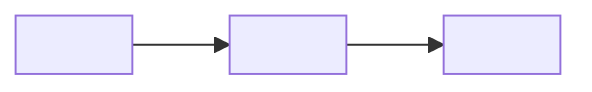

# 09 · Map — <SLUG>

> The canonical map is `docs/architecture/map.md` and it outlives this spec.
> This file carries the **drift** and the **evidence**.

## Drift

What this change did to the shape of the project. If the canonical map did not
exist before this run, say so — then this table is the whole map.

| Change | Element | Before | After | Commit |
|--------|---------|--------|-------|--------|
| moved / added / removed / renamed | `<module or path>` | | | `<sha>` |

**Already fiction.** Boxes and arrows the previous map showed that had nothing
behind them *before* this change. Finding these is the most valuable thing this
phase does, and it only happens when someone opens the edges.

| Element on old map | Reality | `file:line` | Action |
|--------------------|---------|-------------|--------|
| | never existed / removed in `<sha>` / renamed | | corrected / deleted |

## The flow this change touched

End to end, one flow. Not the whole system.

## Edge evidence

An arrow means a real import, call, HTTP request, queue message or foreign key.
An arrow drawn because it makes architectural sense is the lie a reader cannot
detect.

| Edge | Kind | Evidence | Verified |
|------|------|----------|----------|
| A → B | import / call / HTTP / queue / FK | `file:line` | yes / **unbacked** |

<Any `unbacked` row: remove the arrow, or move it to "Not drawn" with a reason.
Do not ship it as a solid line.>

## Node inventory

A box with no directory behind it is a wish.

| Node | Path | Owns | Public surface |
|------|------|------|----------------|
| | `<dir>` | | |

## Not drawn

| Left out | Why | Where it is described instead |
|----------|-----|-------------------------------|
| | too far from this change / already in `<doc>` / not stable yet | |

## Canonical map updated

| | |
|---|---|
| File | `docs/architecture/map.md` |
| Commit | `<sha>` |
| Levels present | context · modules · flows |
| Last updated before this | `<date>` by `<slug>` |

<A long gap since the last update means the map was regenerated, not maintained.
Say so — the drift table above is then less trustworthy than it looks.>

## Expiry

| Part of the map | Goes false when |
|-----------------|------------------|
| | |

## Open questions

| # | Question | Blocks | Who can answer |
|---|----------|--------|----------------|
| Q<n> | | | |
